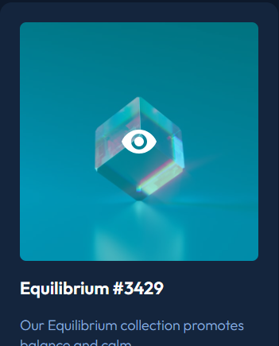

# NFT preview card component
Esse projeto é um layout de um NFT card, desenvolvido no módulo de reforço de CSS no curso do Dev em Dobro, feito em um workshop. Foi retirado do [Frontend Mentor](https://www.frontendmentor.io/challenges/nft-preview-card-component-SbdUL_w0U).

## Tecnologias utilizadas
- HTML;
- CSS.

## Interações
Na imagem há uma interação com o cursor, aparece um ícone e a imagem fica com uma opacidade.

